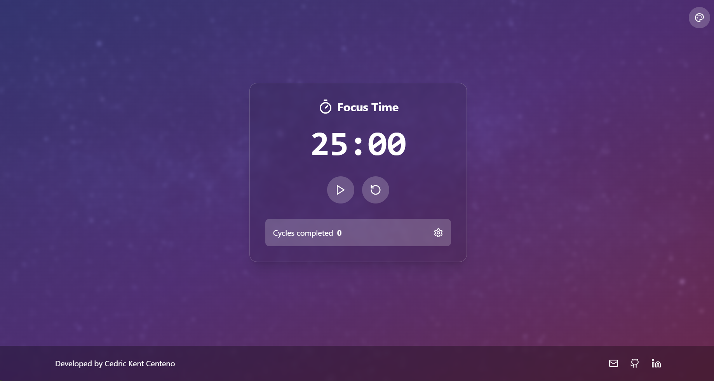
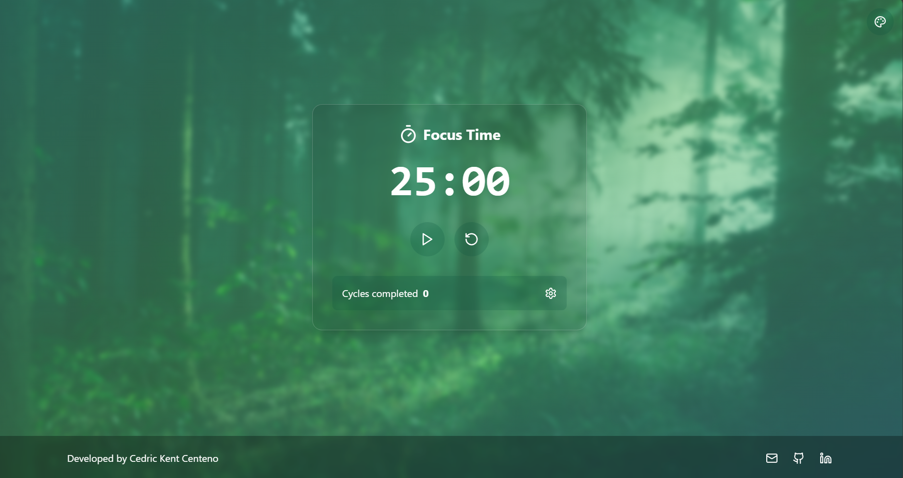
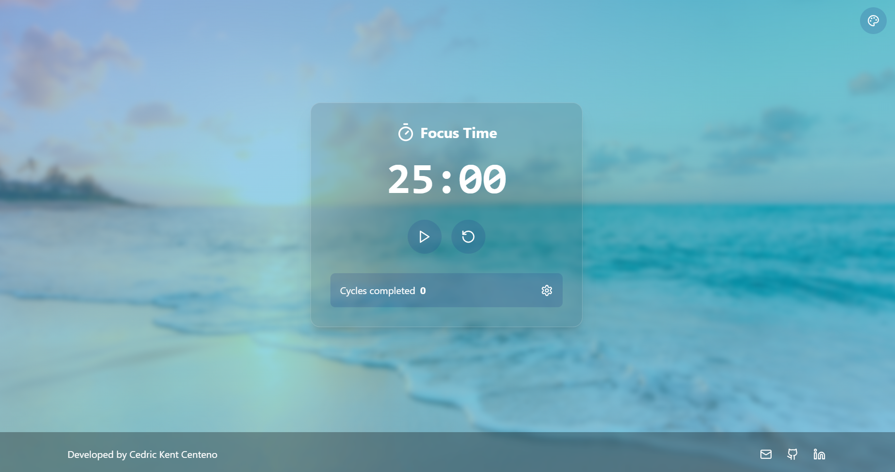
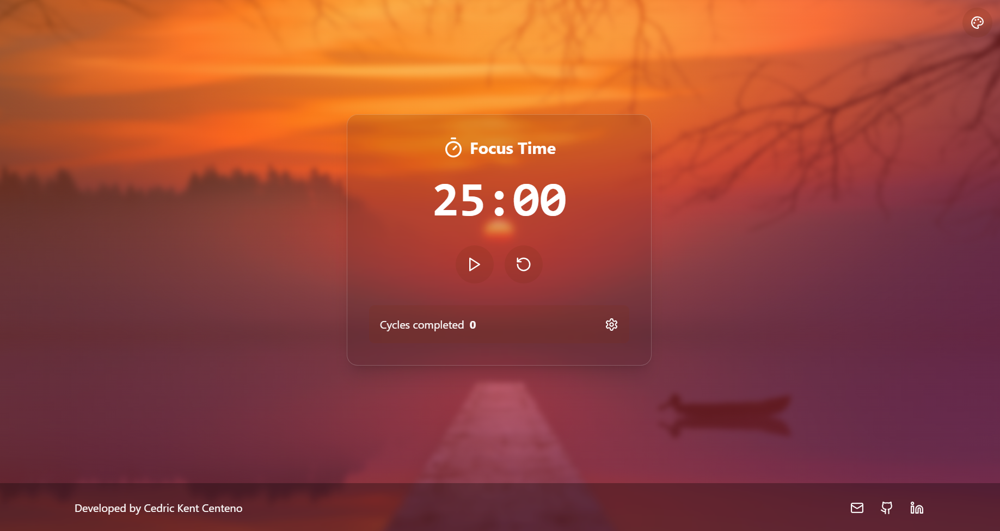

# Pomodoro Focus Timer

A Pomodoro timer application built with React and TypeScript. This application helps users maintain focus and productivity using the Pomodoro Technique, a time management method that uses a timer to break work into intervals.

## Features

- 🎯 Customizable work, break, and long break durations
- 🔄 Automatic break scheduling
- 🎨 Beautiful themes with dynamic backgrounds
- ⚡ Responsive design
- ⌨️ Keyboard shortcuts support
- 🔔 Audio notifications
- ⚙️ Configurable settings

## Screenshots

### Twilight Theme


### Forest Theme


### Ocean Theme


### Sunset Theme


## Tech Stack

- React
- TypeScript
- Tailwind CSS
- Vite
- Lucide Icons

## Getting Started

1. Clone the repository:
   ```bash
   git clone https://github.com/cdrcknt/pomodoro-focus-timer.git
   ```

2. Install dependencies:
   ```bash
   cd pomodoro-focus-timer
   npm install
   ```

3. Start the development server:
   ```bash
   npm run dev
   ```

## Developers

- Cedric Kent Centeno
  
## License

This project is licensed under the MIT License - see the [LICENSE](LICENSE) file for details.